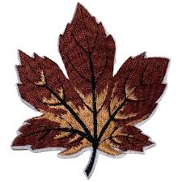

# les4-c


## kleiner kopje
dit is tekst
### nog kleiner kopje
dit is tekst


dit is **belangrijk**

[dit is mijn pagina](https://sjo.hosts1.ma-cloud.nl/wiskundePortfolio2017/)

<j.sjollema@ma-web.nl>



---


1. eerste
2. tweede
3. derde
---

* dit is iets
* dit is iets anders
* nog wat

1. ik ga naar school
   1. dan met de bus
   2. met de trein
   3. weer met de bus
2. ga ik verder

``` cs
// voorbeeld
for(int i = 0 ; i< 10 ; i++>){
    goRound();
}

````

```css
body {
  background-color: #f0f0f0;
  font-family: Arial, sans-serif;
}

h1 {
  color: #333;
}
```
